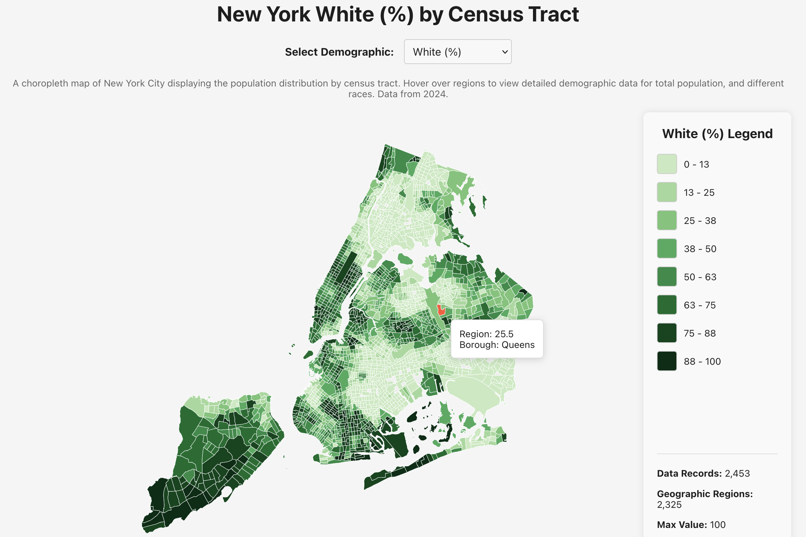
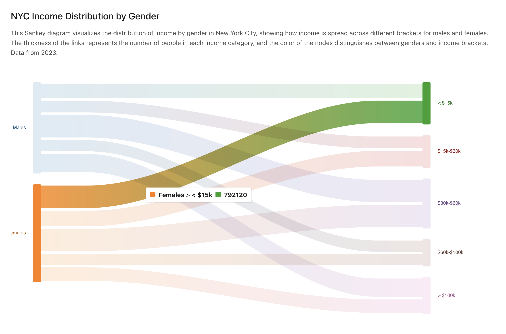
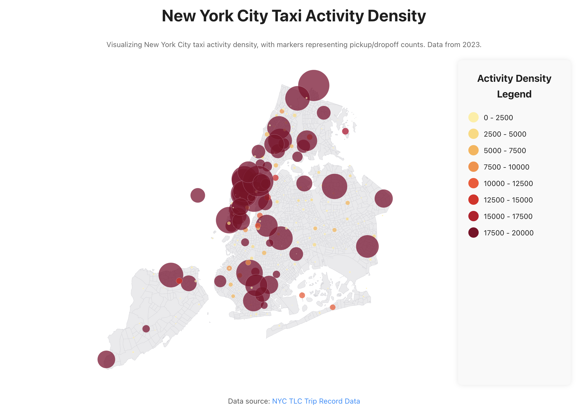
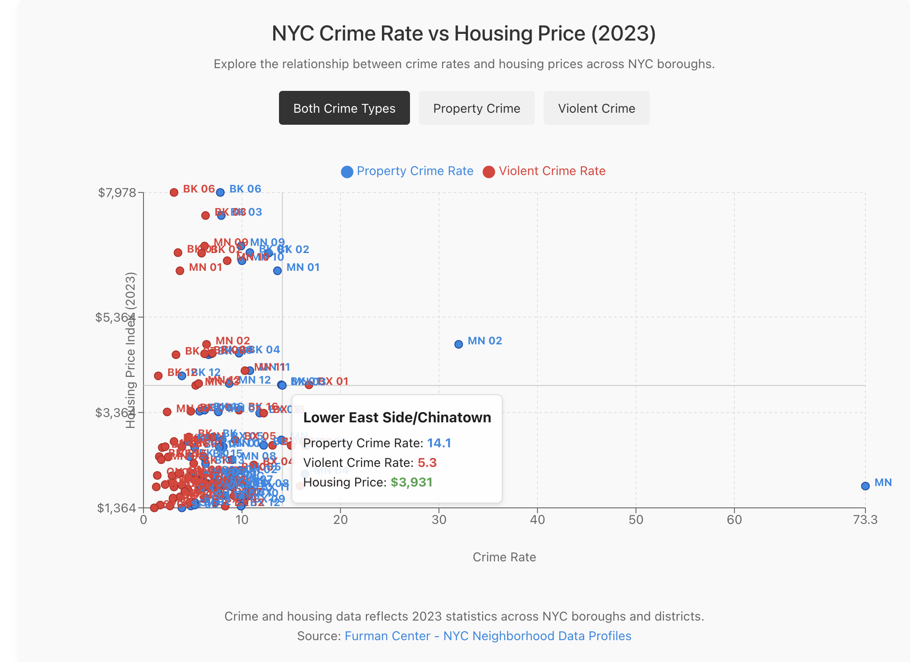

# NYC Socioeconomic Data Visualization Dashboard

This project is an interactive data visualization dashboard presenting key socioeconomic, demographic, housing, mobility, and crime-related insights for **New York City**. Built with **React**, **Recharts**, **Mapbox/Leaflet**, and **Tailwind CSS**, the dashboard provides policymakers, researchers, and citizens with a powerful tool to explore data trends across time and geography.

##  Overview

This dashboard compiles and visualizes multiple datasets from public NYC sources, covering areas such as:

- Population by gender and race
- Income distribution
- Housing market trends
- Crime rate patterns
- Consumer spending
- Taxi mobility activity
- Poverty levels
- Consumption behavior

Each visualization has a dedicated module, accessible via a central dashboard.

## Visualizations

| Visualization | Type | Description |
|---------------|------|-------------|
| 🗺️ **NYC Choropleth Map of Population by Gender** | Choropleth Map | Visualizes the gender distribution across NYC boroughs and neighborhoods. |
| 🗺️ **NYC Choropleth Map of Population by Race** | Choropleth Map | Shows racial demographics by geography. |
| 🗺️ **NYC Choropleth Map of Income** | Choropleth Map | Represents median household income distribution. |
| 🗺️ **NYC Bubble Map by Taxi Activity Density** | Bubble Map | Highlights high-density pickup/drop-off taxi zones. |
| 📉 **Consumer Spending Bar Graph** | Bar Chart | Shows average and total consumer spending patterns across categories. |
| 📈 **Per Capita Consumption Over Time** | Line Chart | Visual trend of per capita consumption for NYC residents. |
| 🗺️ **Housing Prices Over Time Choropleth Map** | Choropleth Time Map | Tracks housing price evolution geographically. |
| 📊 **Poverty Rates by Geography** | Bar Graph | Compares poverty rates across NYC boroughs. |
| 🗺️ **Crime Rate by Neighborhood** | Choropleth Map | Maps crime rates across local precincts or neighborhoods. |
| 📊 **NYC Key Indicators Dashboard** | Dashboard View | Aggregated view of key metrics (Income, Crime, Housing, Poverty). |
| 🪢 **Income Distribution by Gender Sankey Map** | Sankey Diagram | Shows how income brackets are distributed across genders. |
| 📈 **Median Household Income by Race Over Time** | Line Graph | Illustrates income inequality over years by race. |
| ⚖️ **Crime Rate vs Housing Price** | Scatter Plot | Reveals correlations or patterns between safety and housing market. |

## 🖼️ Screenshots

You can insert preview images of your visualizations here:

## Population by Race

## Income Distribution by Gender

## Taxi Activity

## Crime vs Housing Price
